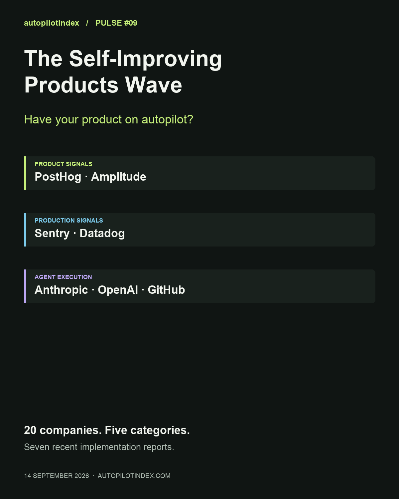
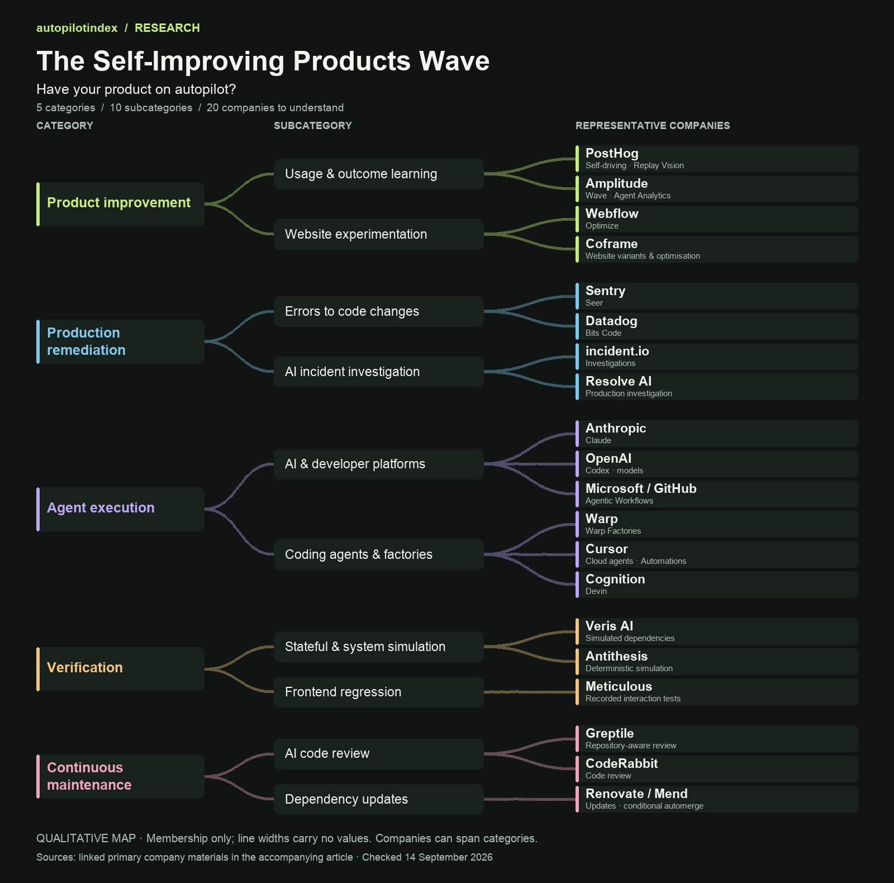

# The Self-Improving Products Wave

*Autopilot Pulse #09 · 2026-09-14*

## The short version

- Have your product on autopilot? A market map of 20 companies, five categories and ten subcategories, with seven recent implementation reports.
- **PostHog and Amplitude** start with product signals. **Sentry and Datadog** start with production evidence. **Anthropic, OpenAI and GitHub** supply execution capabilities.
- **PostHog has a public production deployment record. Sentry dates its internal rollout to mid-July.** Other cases range from customer-reported live use to a simulator demonstration; the dates and limits are stated.
- **Scaling requires more than generating code:** shared environments, useful review, feedback that persists and evidence that the change helped.

**Have your product on autopilot?** A user gets stuck. Your software spots the friction, investigates it and prepares a change. The next morning, you review the evidence and decide what ships.

That is becoming a practical product category. The companies building it come from different starting points: product analytics, production monitoring, AI coding and verification. This edition maps **20 companies across five categories and ten subcategories**, then looks at seven recent implementation reports.

The reporting window is **14 July–14 September 2026**. A publication date is not necessarily a deployment date; each case below identifies what is known. The shortlist is an editorial assessment of relevant capabilities, distribution and evidence, not a market-share ranking.

## 1 — The companies to understand first

**PostHog and Amplitude: product decisions.** PostHog combines usage signals with agents that propose changes. Amplitude combines product analytics, experimentation and agent evaluation; its Wave product is labelled closed beta. HYBRD’s production case below uses Agent Analytics, which should not be confused with a Wave deployment.

**Sentry and Datadog: production context.** Sentry’s Seer and Datadog’s Bits Code connect operational evidence to proposed fixes. Sentry supplies a dated internal rollout and a practitioner account in this window. Datadog belongs on product scope and incumbent relevance; its June launch is not a recent customer deployment.

**Anthropic, OpenAI and Microsoft/GitHub: execution.** These companies supply models, coding agents or repository workflows. Their role is visible inside other companies’ implementations: Claude in Sentry and Warp, Codex at loveholidays. GitHub’s cited Agentic Workflows announcement establishes public preview at its June launch.

**Warp, Cursor and Cognition: coding-agent platforms and factories.** Warp is especially relevant because its agents improve their own instructions from feedback. Cursor documents event-triggered automations and appears in a customer’s repair workflow. Cognition’s Devin example makes test recordings and untested areas part of the review package.

My reading: product-data platforms are well placed to identify valuable work, observability platforms to explain failures, and AI platforms to execute changes. A customer may combine all three.

[PostHog self-driving](https://posthog.com/self-driving) · [Amplitude Wave — closed beta](https://amplitude.com/wave) · [Datadog Bits Code — June announcement](https://www.datadoghq.com/blog/bits-code/) · [GitHub Agentic Workflows — June preview announcement](https://github.blog/changelog/2026-06-11-github-agentic-workflows-is-now-in-public-preview/) · [Cursor Automations](https://cursor.com/docs/cloud-agent/automations) · [Warp factory architecture](https://www.warp.dev/blog/agent-self-improving-software-factories)

## 2 — Five categories, ten subcategories

**Product improvement:** usage and outcome learning — PostHog, Amplitude. Website experimentation — Webflow Optimize, Coframe.

**Production remediation:** errors to code changes — Sentry, Datadog. AI incident investigation — incident.io, Resolve AI.

**Agent execution:** established AI and developer platforms — Anthropic, OpenAI, Microsoft/GitHub. Coding agents and factories — Warp, Cursor, Cognition.

**Verification:** stateful and whole-system simulation — Veris AI, Antithesis. Replay-based frontend regression — Meticulous.

**Continuous maintenance:** AI code review — Greptile, CodeRabbit. Dependency updates — Renovate/Mend.

The map gives each company one representative role; many span several. Connections show category membership, not revenue, adoption or partnerships.

These categories solve different problems. Optimising a website, repairing a production failure and improving an agent’s instructions are distinct jobs. The useful comparison is the part of the work each product can take responsibility for.

[PostHog](https://posthog.com/self-driving) · [Amplitude](https://amplitude.com/wave) · [Webflow](https://webflow.com/feature/optimize) · [Coframe](https://www.coframe.com/) · [Sentry](https://docs.sentry.io/product/ai-in-sentry/seer) · [Datadog](https://www.datadoghq.com/blog/bits-code/) · [incident.io](https://incident.io/investigations) · [Resolve AI](https://resolve.ai/) · [Anthropic](https://claude.com/blog/how-warp-builds-self-improving-agents-on-claude) · [OpenAI](https://openai.com/index/loveholidays/) · [Microsoft / GitHub](https://github.blog/changelog/2026-06-11-github-agentic-workflows-is-now-in-public-preview/) · [Warp](https://www.warp.dev/blog/agent-self-improving-software-factories) · [Cursor](https://cursor.com/docs/cloud-agent/automations) · [Cognition](https://openai.com/index/cognition-devin-testing-with-astra/) · [Veris AI](https://veris.ai/) · [Antithesis](https://antithesis.com/) · [Meticulous](https://www.meticulous.ai/) · [Greptile](https://www.greptile.com/) · [CodeRabbit](https://www.coderabbit.ai/) · [Renovate / Mend](https://docs.renovatebot.com/key-concepts/automerge/)

## PostHog: a confusing installation screen became a deployed fix

**Stage: internal production use, with a public deployment record. Deployment: 29 July. Report: 31 July.**

PostHog’s Replay Vision account describes a scanner identifying dead clicks on an installation screen. Investigation also found repeated refresh requests producing rate-limit errors. The change clarified the button, kept documentation in a separate tab and removed automatic refresh on page load.

PR #67643 records human approval, a merge on 29 July, 196 passing checks and deployment entries for both US and EU production. Its original description acknowledges that the agent could not run the frontend environment itself. This supports a real change through review and CI; it does not establish that the agent independently completed every verification step or quantify subsequent user benefit.

**Why it matters:** a traceable path from observed friction to production, with human and automated contributions visible.

[PostHog’s account](https://posthog.com/blog/replay-vision) · [Public PR and deployment record](https://github.com/PostHog/posthog/pull/67643)

## HYBRD + Amplitude: production conversations exposed a prompt defect

**Stage: named customer production use. Report: 28 July; exact deployment day not disclosed.**

HYBRD’s CTO describes investigating complaints that its coaching agent needed a second request before running a tool. An evaluator applied to a week of sampled conversations flagged the behaviour in 25% of them. The team shipped a fix, mostly prompt changes, the same day and reported that the rate fell; it did not publish the final rate.

The account also reports more than fourfold retention and conversion among users engaging with the agent. That is a cohort association, not proof that the prompt fix caused a fourfold improvement. The implemented loop is concrete: complaint, evaluation, prompt change and follow-up measurement.

**Why it matters:** improvement can occur in prompts and tool behaviour without generating an application-code PR. This supports Amplitude’s measurement role, separate from Wave.

[HYBRD’s account](https://amplitude.com/blog/hybrd-agent-evals-retention-signal)

## Sentry + Claude: expanding automation into the review workflow

**Stage: internal operational rollout across multiple projects. Rollout: mid-July. Report: 6 August.**

Sentry enabled Seer autofix across its core application, documentation, MCP server and CLI. A scheduled Claude routine checks new PR notifications, identifies a reviewer, confirms the PR needs action and requests feedback.

The company reports approximately 21% higher PR action rate, 13% higher 48-hour response rate and 12.5% more closures without merging. These are early reported changes, with no cohort size or clear percentage-versus-percentage-point definition. Closure can mean a duplicate or a reviewer choosing a broader fix; it is not equivalent to a successful agent merge.

**Why it matters:** scaling includes routing, ownership and review capacity. The operating process around the agent determines whether its output gets used.

[Sentry’s implementation report](https://blog.sentry.io/automated-debugging-workflow-sentry/)

## Sentry + Cursor: a customer moves from backlog to recurring fixes

**Stage: customer-reported production maintenance. Report: 23 July; full intervention period unspecified.**

Developer Dan Mindru describes reducing a backlog from 57 bugs to one using several approaches. Straightforward issues use Seer-generated PRs. More involved work is handed to Cursor’s cloud agent, which can run an application and tests. Difficult cases still need human context and verification.

One fix was generated after a colleague enabled the integration a few days earlier and was merged by Mindru. The headline is a practitioner’s account across workflows, not a measured 98% autonomous resolution rate.

**Why it matters:** a practical division of labour between an observability incumbent and a coding-agent platform.

[Customer account on Sentry’s blog](https://blog.sentry.io/57-bugs-to-1/)

## Warp + Claude: agents improve instructions for the next run

**Stage: operational use across Warp’s open-source repository, as reported. Report: 26 August; rollout start unspecified.**

Warp separates each agent’s task instructions from an improver that periodically reads accumulated feedback. The improver proposes a small instruction edit through a pull request. A person reviews and merges it before later runs inherit the change.

In the published triage example, maintainer feedback led to a proposed correction to when the agent applies a readiness label. Warp says the pattern operates across triage, specification and review agents. The account describes hundreds of contributors and thousands of reviews, but no controlled before-and-after accuracy result.

**Why it matters:** the development process itself improves. Feedback persists as an inspectable change instead of disappearing with a conversation.

[Anthropic’s account of Warp’s implementation](https://claude.com/blog/how-warp-builds-self-improving-agents-on-claude)

## loveholidays + Codex: prototypes become live customer experiences

**Stage: prototype-to-production expansion. Report: 26 August; individual go-live dates unspecified.**

loveholidays built Search Playground around its design system, frontend stack and Codex. Its account describes more than ten new search experiences, mostly built by non-engineers, with at least three running on the customer website.

The report also says successful AI-assisted Data Platform changes rose from 58% to 93% over a year. That longer period must not be presented as a two-month gain. This demonstrates expanded participation and prototypes reaching production, while people choose the work and maintain the standards.

**Why it matters:** scaling includes reusable components, codified checks and access to specialist knowledge.

[OpenAI’s loveholidays case study](https://openai.com/index/loveholidays/)

## Cognition + OpenAI: a working verification example, with scale unquantified

**Stage: reported product integration plus a simulator demonstration. Report: 11 September; production rollout scope unspecified.**

Cognition describes using GPT-6 Astra across Devin, CLI and desktop products. In one example, Devin tests an iPhone game in a simulator and returns a recording plus a report of checks completed and areas left untested. The company also describes fixing customer-reported bugs and returning screenshots.

This establishes a concrete verification use case. It does not establish how broadly the specific capability is deployed, a production success rate or measured savings in manual review.

**Why it matters:** a useful pilot output is evidence a reviewer can inspect, including what was not tested. Scaling requires consistent environments and repeatable checks.

[OpenAI’s Cognition case study](https://openai.com/index/cognition-devin-testing-with-astra/)

## 3 — The path from pilot to scale

**Make one narrow repair repeatable.** PostHog’s case ties a source signal to a deployed change. Expansion depends on whether detection, verification and review remain useful as volume grows.

**Build an operating workflow around the agent.** Sentry adds reviewer ownership and feedback. Warp turns feedback into versioned instructions. A growing queue of unreviewed PRs is not a scaling strategy.

**Give more people a reliable way to build.** loveholidays combines reusable components, specialist expertise and checks. HYBRD shows why teams also need a fast way to measure behaviour once the product is live.

For a pilot, ask whether the workflow produces a useful result. For expansion, track accepted changes, review effort, escaped regressions and cost per durable improvement. At production scale, connect those measures to the user or operational outcome.

If you are starting from product friction, look first at PostHog and Amplitude. For reliability, look at Sentry and Datadog. If you are assembling your own loop, compare the AI platforms with Warp, Cursor and Cognition against the signals and environments you already have.

**What would you put on autopilot first: finding product friction, fixing bugs, checking changes or maintaining dependencies?**

— Antonio, the human in the loop
